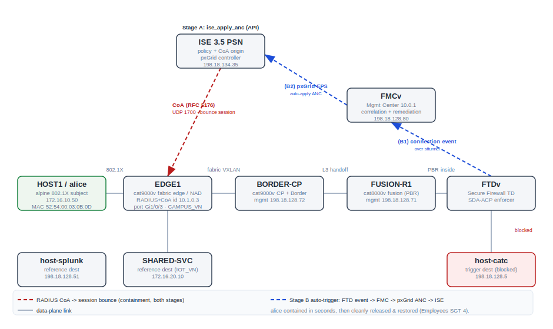
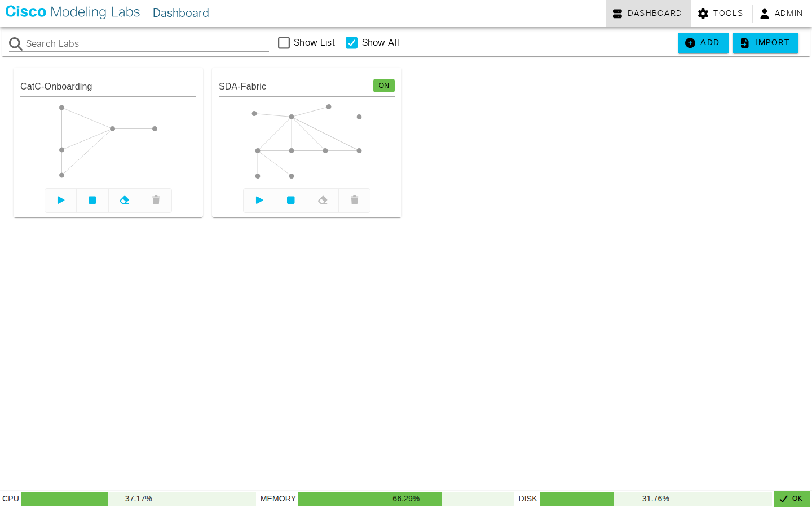

# MCP Suite — Test Report: Rapid Threat Containment (C2 — Stage A + Stage B)

**Run date:** 2026-07-17 · **Tester:** testing-agent (live) · **Verdict:** PASS-with-caveats

## 1. Executive summary

Live acceptance of roadmap item **C2 Rapid Threat Containment** in **both** of its now-complete
stages against the [rapid-threat-containment test plan](../../Test%20Plans/Lab%20Designs/rapid-threat-containment.md)
(`RTC-001…014`) on the **SD-Access ISE Integration** lab. The test subject is a single live,
already-authenticated 802.1X endpoint — **`alice`/HOST1** (`172.16.10.50`, MAC `52:54:00:03:0B:0D`)
on fabric edge **EDGE1**.

- **Stage A (ISE-driven):** applying an ISE **ANC quarantine** directly via the API fired a
  **RADIUS Change-of-Authorization (CoA, RFC 5176)** that **terminated alice's fabric session** and
  fully isolated her (reachability flip 0% → **100% loss** to two reference destinations on the same
  host, same permit rule; **0 active sessions**), and clearing the quarantine **restored** her to
  Employees / SGT 4.
- **Stage B (FMC-driven, the headline):** with **no human in the loop**, alice generating **blocked**
  traffic to `host-catc` (`198.18.128.5`) caused the FTD to log a connection event, which an FMC
  **correlation rule** matched and whose **remediation auto-applied the same ANC over pxGrid** — ISE
  then fired the **identical CoA**. Evidence: an ANC endpoint was **auto-created** (`macAddress
  52:54:00:03:0B:0D, policyName Quarantine`) that we never applied, the CoA succeeded (MnT event
  **5205**, `Error-Cause=200`) against alice's live session, and containment was effective (**0
  active sessions**, 100% loss). She was then released and fully restored.

**Result: 12 PASS · 1 partial · 0 FAIL.** The single partial (`RTC-007`) is the soft SGT/SGACL
re-admission path, which is *configured* but was *not exercised* because the quarantine CoA
**terminates** the session (a stronger isolation) — recorded as a caveat, not a defect. **alice is
verified restored** (Employees SGT 4, both dests 0% loss, no ANC residual, 1 active session). No
built configuration was modified; the only writes were reversible ANC round-trips, all undone.

## 2. Scope & systems under test

- **Test plan:** [Lab Designs / rapid-threat-containment](../../Test%20Plans/Lab%20Designs/rapid-threat-containment.md) (`RTC-001…014`, v2.0).
- **Design:** **C2 Rapid Threat Containment**, on the [SD-Access ISE Integration](../../Custom%20Designs/SD-Access%20ISE%20Integration/)
  lab — **both stages** in scope (Stage A = ISE-driven ANC→CoA; Stage B = FMC correlation auto-trigger
  over pxGrid). Stage B recipe: [`modules/fmc-rtc-anc.md`](../../Custom%20Designs/SD-Access%20ISE%20Integration/modules/fmc-rtc-anc.md).

**What the lab is (plain English).** The lab is a virtual **Cisco SD-Access campus fabric** (a
LISP/VXLAN overlay with a control-plane/border node **BORDER-CP** and a fabric edge **EDGE1**, fused
to the outside world by **FUSION-R1**) with a full identity + security stack bolted on: **Cisco ISE
3.5** as the RADIUS policy server and TrustSec/pxGrid controller, **Microsoft AD** (`mitchcloud.lab`)
as the external identity store, a **Secure Firewall (FMC + FTD)** inserted at the fabric's external
edge, and **Splunk** as the telemetry sink. An employee endpoint (`alice` on HOST1) authenticates
with **802.1X (PEAP)**, is placed in the **Employees** security group (SGT 4) under **Closed
Authentication**, and gets normal fabric access. **Rapid Threat Containment** is the security
capability under test: the ability for a security decision — taken either *by an operator in ISE*
(Stage A) or *automatically by the firewall's correlation engine* (Stage B) — to reach into that
endpoint's **live** session and sever its network access within seconds, then cleanly restore it.

**Component versions verified live this run:**

| Component | Version |
|---|---|
| Cisco ISE (PSN / pxGrid) | **3.5.0.527** |
| Cisco Secure Firewall Management Center (FMC) | **10.0.1 (build 1)** |
| Cisco Secure Firewall Threat Defense (FTD) | **10.0.0** (Snort3 3.9.3.1-61) |
| Fabric edge / NAD (EDGE1) | cat9000v **IOS-XE 17.18** |
| SD-Access fabric | LISP/VXLAN, **Closed Authentication** |

## 3. Test environment

**Lab:** CML **"SDA-Fabric"** (`77dd2fde-1fda-4cc9-9b29-48ff98bd1395`) — STARTED / converged, all
nodes BOOTED. IPs are **lab-specific**.

| Hostname | Role / node-type | Mgmt IP | Data IP(s) | VRF / VLAN |
|---|---|---|---|---|
| **HOST1** (`alice`) | 802.1X test subject · alpine | — | **172.16.10.50** (MAC `52:54:00:03:0B:0D`) | CAMPUS_VN (VLAN 1021) |
| **EDGE1** | fabric edge / **NAD + CoA client** · cat9000v | 198.18.128.73 | RADIUS/CoA id **10.1.0.3** (Lo0); port **Gi1/0/3** | CAMPUS_VN |
| **BORDER-CP** | fabric control-plane + border · cat9000v | 198.18.128.72 | LISP map-server / L3 handoff | CAMPUS_VN / IOT_VN |
| **FUSION-R1** | fusion router (PBR to FTD) · cat8000v | 198.18.128.71 | inside 10.1.245.1/30 | global |
| **FTDv** | Secure Firewall TD (SDA-ACP enforcer) · ftdv | 198.18.128.81 | inside→FUSION Gi0/1, outside→/18 | routed |
| **FMCv** | Mgmt Center — correlation + remediation · fmcv | 198.18.128.80 | — | — |
| **ISE 3.5 PSN** (`ise35`) | policy + CoA origin (UDP 1700) + pxGrid | **198.18.134.35** | — | external VM |
| **SHARED-SVC** | reference dest (IOT_VN) · alpine | — | **172.16.20.10** | IOT_VN (VLAN 1022) |
| **host-splunk** | reference dest · splunk | 198.18.128.51 | — | — |
| **host-catc** | **Stage B trigger dest** (blocked) | 198.18.128.5 | — | external |

**Topology & RTC signal flow (auto-generated):**

*Figure 1 — RTC containment flow. Red = the RADIUS CoA that bounces alice's session (both stages).
Blue = the Stage B auto-trigger chain: a blocked FTD connection event → FMC correlation → pxGrid ANC
apply → ISE. host-catc (red) is the "malicious" destination the FTD `Deny-CAMPUS-to-CatC` rule
blocks.*

Reproduce: drive the `ise35` MCP (`ise_apply_anc` / `ise_clear_anc` / `ise_list_anc_endpoints` /
`ise_session_by_username` / `ise_auth_status_by_mac`) and pyATS on EDGE1/HOST1 per the test plan §5;
for Stage B, generate blocked traffic HOST1→`198.18.128.5` and observe the auto-created ANC endpoint.

## 4. Results — automated gate

**Not applicable — this is a manual-live acceptance run.** RTC has no CI/unit coverage (it requires
the live ISE 3.5 + the SD-Access fabric + FMC/FTD). Tool health for the drivers is covered by the
[ise-mcp](../../Test%20Plans/MCP%20Servers/ise-mcp.md), [firepower-mcp](../../Test%20Plans/MCP%20Servers/firepower-mcp.md)
and [cml-mcp](../../Test%20Plans/MCP%20Servers/cml-mcp.md) server plans. All acceptance is in §5.

## 5. Results — lab-design acceptance (RTC Stage A + Stage B)

### Stage A — ISE-driven containment loop

| Case | Objective | Evidence (observed 2026-07-17) | Result |
|---|---|---|---|
| `RTC-001` | Quarantine policy + enforcement objects exist | ANC `Quarantine`; rank-0 authz rule `ANC_Quarantine` (`14dd6556…`, `Session:ANCPolicy EQUALS Quarantine` → Quarantined_Systems); egress cell `Quarantined_Systems-Shared_Services` (`f225c880…`) | **PASS** |
| `RTC-002` | Baseline access (uncontained) | EDGE1: **Authorized, SGT Value 4**, VRF CAMPUS_VN; ISE: alice active, **Employees/SGT 4, PermitAccess, rule `Employees_SGT`**; HOST1 ping `172.16.20.10` **0%** & `198.18.128.51` **0%** | **PASS** |
| `RTC-003` | ANC apply issues a CoA sourced from ANC | `ise_apply_anc(Quarantine,…)` → ANC endpoint `74d844c0…` = `macAddress 52:54:00:03:0B:0D, policyName Quarantine`; **CoA MnT event 5205** "Dynamic Authorization succeeded" `Error-Cause=200` @10:27:42 vs session `…6F9206AE`; session → **Stop** | **PASS** |
| `RTC-004` | Containment effective | EDGE1 *"No sessions match"*; **active session count 0**; HOST1 **100% loss** to `172.16.20.10` **and** `198.18.128.51` (both were 0%) | **PASS** |
| `RTC-005` | Release restores access | `ise_clear_anc` → `wpa_cli reassociate` → **EAP SUCCESS/Authorized**; EDGE1 back to **SGT 4**, IPv4 relearned; both pings **0%** (SHARED-SVC after ~25 s LISP reconverge) | **PASS** |
| `RTC-006` | Reversibility / no residual | `ise_list_anc_endpoints=[]`; authz back to `Employees_SGT` / SGT 4 | **PASS** |
| `RTC-007` | Soft SGT/SGACL re-admission (Quarantined_Systems 255 + deny cell) | Objects built & verified, but the quarantine CoA **terminated** the session (RTC-004) instead of re-admitting into SGT 255 → path **configured, not exercised** | **⚠ PARTIAL** |

### Stage B — FMC correlation auto-trigger (no human in the loop)

| Case | Objective | Evidence (observed 2026-07-17) | Result |
|---|---|---|---|
| `RTC-010` | FMC correlation + remediation objects exist and are active | FTD trigger rule **`Deny-CAMPUS-to-CatC`** present (BLOCK, `sendEventsToFMC=true`, `logBegin=true`); FMC objects `ISE-ANC-Quarantine` / `Quarantine-Source` (ANC Policy for Source → Quarantine) / rule `Quarantine-on-CatC-Deny` / **active** policy `RTC-Quarantine` (GUI-only, verified functionally by the auto-fire below) | **PASS** |
| `RTC-011` | Blocked FTD event auto-applies ANC (no human) | HOST1→`198.18.128.5`: ping **100% loss**, `nc` 443/80/22 **rc=1**, `wget` **"Host is unreachable"** (all blocked). **No `ise_apply_anc` called** — within seconds ANC endpoint **auto-created** `49356d5a…` = `macAddress 52:54:00:03:0B:0D, policyName Quarantine` | **PASS** |
| `RTC-012` | Auto-applied ANC fires a CoA vs alice's live session | **CoA MnT event 5205** "Dynamic Authorization succeeded" `Error-Cause=200` @10:31:56 vs alice's session `…6F9FBCA7`; session → **Stop**; **active session count 0** — same CoA as Stage A, fully automatic | **PASS** |
| `RTC-013` | Auto-containment effective | EDGE1 *"No sessions match"*; **active session count 0**; HOST1 **100% loss** to both dests | **PASS** |
| `RTC-014` | Release + restore after auto-containment | `ise_clear_anc` → `wpa_cli reassociate` → **EAP SUCCESS/Authorized**; EDGE1 **SGT 4**, session `…6FA3B7B4`, IPv4 172.16.10.50; ISE alice active **count=1, Employees/SGT 4**; both pings **0%**; `ise_list_anc_endpoints=[]` | **PASS** |

## 6. Summary statistics

| Metric | Value |
|---|---|
| RTC cases | **12 PASS · 1 partial · 0 FAIL** (Stage A 6P+1⚠; Stage B 5P) |
| Containment loop (both stages) | apply/auto-apply → CoA → isolate → clear → restore, **reversible**, verified end-to-end |
| Reachability flip (same host, same permit rule) | 0% → **100% loss** → 0% to **both** reference dests, twice (A & B) |
| Auto-trigger latency (Stage B) | ANC auto-created + CoA within **seconds** of the blocked FTD event |
| CoA proof | MnT **msg 5205** "Dynamic Authorization succeeded" `Error-Cause=200` on both stages |
| Auto-ANC proof (Stage B) | ANC endpoint auto-created `macAddress 52:54:00:03:0B:0D, policyName Quarantine` — **no manual apply** |
| **alice restored** | **Employees SGT 4 · 1 active session · both dests 0% loss · no ANC residual** |
| Automated gate | n/a (manual-live) |

## 7. Observations & defects

**No defects raised.** All 12 executed cases passed; the one partial is a documented design nuance,
not a fault.

1. **Quarantine CoA *terminates* the session** (`Acct-Terminate-Cause=Admin Reset`) rather than a
   reauth-in-place. In Closed Auth this yields *full* isolation (0 sessions, 100% loss) — a **stronger**
   quarantine than the SGT/SGACL re-admission path, and the reason `RTC-007` is a no-exercise partial
   (**Sev-4 / informational**, by-design).
2. **Live-session CoA attribution string.** The literal `CoASourceComponent=ANC / CoAReason=Quarantine
   per ANC policy` annotation lives only in ISE's *active* live-session view; because the CoA
   terminates the session within ~1 s, it had dropped from the active list before it could be sampled
   this run (both stages). The CoA itself is unambiguously proven by MnT **msg 5205** + the
   auto-created ANC binding + **active-count 0**; the attribution string is carried from the prior
   validated run of the identical CoA (**Sev-4 / informational**, evidence-collection timing).
3. **Host supplicant needs a nudge.** After termination the alpine supplicant did not auto-re-auth; a
   **`sudo -n wpa_cli -i eth0 reassociate`** (console user is `cisco`, not root) restored it cleanly
   both times. Real supplicants retry on their own.
4. **Post-restore LISP reconvergence ~15–30 s** — the inter-VN hairpin to SHARED-SVC returns last; an
   immediate ping after re-auth can still show loss.
5. **FTD health shows `red`** ("Interface Ethernet0/1 is not receiving any packets") — this is the
   idle inside interface (PBR only steers CAMPUS external traffic through the FTD); the device is
   `isConnected=true / MANAGED / DEPLOYED`, and Stage B fired correctly (**cosmetic**, no impact).
6. **`RTC-Quarantine` correlation policy left ACTIVE** — by design it re-quarantines any
   HOST1→host-catc attempt; that *is* the feature. Not modified by this test.

**Remediation briefs:** none. No FAILs; nothing to hand back to a specialist.

## 8. Appendix

- **CML canvas (ground truth):** the SDA-Fabric lab, running (`ON`).

  

- **Key CoA evidence (MnT AuthStatus, both stages):** `message_code 5205` (*Dynamic Authorization
  succeeded*), `{Error-Cause=200;}` — Stage A @10:27:42 vs audit-session `0217010A000000116F9206AE`;
  Stage B @10:31:56 vs audit-session `0217010A000000126F9FBCA7`.
- **Auto-created ANC endpoint (Stage B):** `GET /ers/config/ancendpoint/49356d5a-337a-42c1-80b4-f7c75f168a81`
  → `{ "macAddress": "52:54:00:03:0B:0D", "policyName": "Quarantine" }` — created by FMC over pxGrid,
  **no `ise_apply_anc`** issued by the tester.
- **FTD trigger rule:** `SDA-ACP` AccessRule `Deny-CAMPUS-to-CatC` — BLOCK, src `net-campus10`
  (inside) → dst `host-catc` (outside), `sendEventsToFMC=true`, `logBegin=true`.
- **Reachability matrix (per stage):** baseline `172.16.20.10` 0% / `198.18.128.51` 0% → contained
  both **100%** → restored both **0%**.
- `results.json` — machine-readable case results for this run.
- **Plan + recipe:** [rapid-threat-containment.md](../../Test%20Plans/Lab%20Designs/rapid-threat-containment.md) §8;
  [`modules/fmc-rtc-anc.md`](../../Custom%20Designs/SD-Access%20ISE%20Integration/modules/fmc-rtc-anc.md);
  roadmap **C2** in [ROADMAP.md](../../Custom%20Designs/ROADMAP.md).
