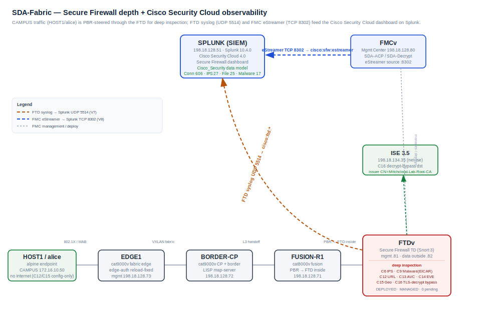
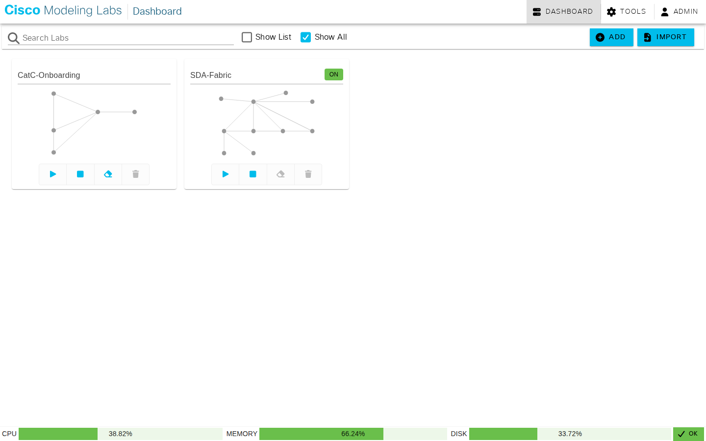

# MCP Suite — Test Report

**Run date:** 2026-07-18 · **Tester:** testing-agent (live) · **Verdict:** PASS

Secure Firewall depth + Cisco Security Cloud observability on the **SDA-Fabric** lab
(`77dd2fde-1fda-4cc9-9b29-48ff98bd1395`) — realizing the **SD-Access ISE Integration**
Custom Design (modules `splunk-security-cloud.md`, `fmc-firewall-depth.md`).
Plan: [secure-firewall-observability](../../Test%20Plans/Lab%20Designs/secure-firewall-observability.md) · `SFW-001…013`.

## 1. Executive summary

Independent, read-only verification of this session's **firewall-depth (C6/C9, C12–C16)** and
**observability (V6–V8)** deliverables on the SD-Access ISE Integration lab. **13 of 13 cases
PASS, 0 FAIL.** The Cisco **Cisco Security Cloud 4.0** app is installed and enabled on Splunk
`.51`, the `Cisco_Security` data model and `secure_firewall_dashboard` view are present, and the
dashboard is fed by **two live paths**: FTD **syslog** (UDP 5514 → `cisco:ftd:*`) and the app's
**eStreamer** input pulling real events from FMC over TCP 8302 (`cisco:sfw:estreamer`). Real
telemetry is flowing end-to-end: the eStreamer feed carries Connection / Intrusion / File events
and every `Cisco_Security.Secure_Firewall_Dataset` child dataset is populated (Connection 606 ·
Intrusion 27 · File 25 · Malware 17). The engineered threats are visible as **real** events — the
C6 IPS signature `LOCAL C6 RTC test trigger` and the C9 EICAR malware file (`eicar.com`,
`SHA_Disposition=Malware`, `ThreatName=EICAR`). All five firewall-depth controls (C12 URL, C13
AVC, C14 EVE, C15 geo, C16 decryption-bypass) are present on `SDA-ACP`/`SDA-Decrypt` and
**deployed** (`fmc_deployable_devices` empty; FTD `DEPLOYED/MANAGED`). The NAC fault that had
blocked live traffic is resolved — recent live FTD connection/syslog events from the data
interface `198.18.128.82` confirm HOST1 traffic is transiting and being logged.

**Verdict: PASS.** The run was **read-only** (FMC/Splunk GET + SPL search only) — no built
configuration was modified. Two non-blocking observations are recorded (§7): the FTDv health
indicator is **yellow** for a cosmetic air-gapped "Cloud Connector" warning (device is
DEPLOYED/MANAGED/connected, nothing pending), and the report runner's `--smoke` gate aborts on a
`bytes`+`str` bug in its timeout handler — the offline gate is clean and live smoke was evidenced
directly through the MCP read tools.

## 2. Scope & systems under test

**What the lab is.** *SDA-Fabric* is a Cisco **Software-Defined Access** campus in CML: a
cat9000v **fabric edge** (EDGE1), a cat9000v **control-plane + border** (BORDER-CP, LISP
map-server), and a cat8000v **fusion** router (FUSION-R1) carry an alpine endpoint
(**HOST1/alice**, CAMPUS `172.16.10.50`) over a VXLAN fabric. CAMPUS traffic is **PBR-steered at
the fusion through an FMC-managed FTD** (Secure Firewall Threat Defense) so the firewall can apply
deep inspection to east-west and northbound flows. Alongside sits the **observability plane**:
an FMCv managing the FTD, and a **Splunk** SIEM running Cisco's **Cisco Security Cloud** app that
renders the **Secure Firewall dashboard** from FTD telemetry.

**Which design it realizes.** The **SD-Access ISE Integration** Custom Design
(`Custom Designs/SD-Access ISE Integration/`), specifically the modules
`modules/splunk-security-cloud.md` (V6/V7/V8) and `modules/fmc-firewall-depth.md` (C12–C16), plus
the C6 IPS and C9 malware threats surfaced through eStreamer.

**Component versions verified against**

| Component | Version |
|---|---|
| FMCv (Management Center) | 10.0.1 (build 1) |
| FTDv (Threat Defense) | 10.0.0 · Snort 3.9.3.1-61 · VDB build 433 · LSP lsp-rel-20260715-1654 |
| Splunk Enterprise | 10.4.0 |
| Cisco Security Cloud app | 4.0.0 |
| ISE | 3.5.0.527 |
| Fabric switches / router | cat9000v & cat8000v IOS-XE 17.18 |

## 3. Test environment

Inventory (hostname · role / node-type · mgmt IP · data IP(s) · VRF/VLAN):

| Hostname | Role / node-type | Mgmt IP | Data IP(s) | VRF / segment |
|---|---|---|---|---|
| HOST1 | CAMPUS endpoint (alice) / alpine | — | 172.16.10.50 (eth0) | CAMPUS_VN |
| EDGE1 | SD-Access fabric edge / cat9000v-uadp | 198.18.128.73 (Gi0/0) | fabric-attached (Gi1/0/1–3) | Global / CAMPUS_VN |
| BORDER-CP | Control-plane + border, LISP map-server / cat9000v-uadp | 198.18.128.72 (Gi0/0) | Gi1/0/1–3 fabric/handoff | Global |
| FUSION-R1 | Fusion router, PBR → FTD inside / cat8000v | 198.18.128.71 (Gi1) | Gi2/Gi3 handoff · Gi4 → FTD | Global / VN leak |
| FTDv | Secure Firewall Threat Defense / ftdv | 198.18.128.81 (Mgmt0/0) | 198.18.128.82 (Gi0/0 outside) · Gi0/1 inside | inside / outside zones |
| FMCv | Management Center / fmcv | 198.18.128.80 (eth0) | — | mgmt /18 |
| SPLUNK | SIEM — Cisco Security Cloud / splunk | 198.18.128.51 (eth0) | — | mgmt /18 |
| ISE 3.5 | Decrypt-bypass dst (net-ise), NAC / external VM | 198.18.134.35 | — | net-ise |
| SHARED-SVC | Shared-services alpine / alpine | — | fabric SHARED-VN | SHARED_VN |

**Primary figure — labeled topology (auto-generated):**

*Data plane (bottom): HOST1 → EDGE1 → BORDER-CP → FUSION-R1 → FTD (PBR inside). Telemetry plane
(top): FTD data `.82` → Splunk UDP 5514 (`cisco:ftd:*`); FMC `.80` → Splunk TCP 8302 eStreamer
(`cisco:sfw:estreamer`) → Cisco_Security data model → Secure Firewall dashboard.*

Reproduce (automated gate): `uv run python "Test Reports/run_report.py" --outdir "Test Reports/2026-07-18"`.
Live acceptance is driven read-only via the `fmc`, `splunk` and `cml` MCP tools (GET / SPL search).

## 4. Results — automated gate (MCP servers)

From `results.json` (offline level — `ruff` + `pytest`, no live target).

| Server | Plan | ruff | Unit | Result |
|---|---|---|---|---|
| cml-mcp | CML | ✅ | 33p / 0f | PASS |
| ise-mcp | ISE | ✅ | 49p / 0f | PASS |
| firepower-mcp | FMC | ✅ | 6p / 0f | PASS |
| windows-mcp | WIN | ✅ | 15p / 0f | PASS |
| splunk-mcp | SPL | ✅ | 21p / 0f | PASS |
| wlc-mcp | WLC | ✅ | 10p / 0f | PASS |
| **Total** | | **6/6 clean** | **134p / 0f** | **PASS** |

Live read-only **smoke** was evidenced directly through the MCP tools (FMC 198.18.128.80, Splunk
198.18.128.51, CML controller all answered) rather than via `run_report.py --smoke`, which aborts
on a runner defect (O2). Live targets that don't answer would be `UNREACHABLE`, not `FAIL`; none
were unreachable this run.

## 5. Results — lab-design acceptance

Each case read-only; evidence is the exact FMC object / Splunk search result.

| ID | Item | Objective | Result | Evidence |
|---|---|---|---|---|
| SFW-001 | V6 | Cisco Security Cloud app + data model + dashboard view | PASS | `CiscoSecurityCloud` **4.0.0** `disabled=false visible=true`; `Cisco_Security` model registered (`Secure_Firewall_Dataset` + Connection/Intrusion/File/Malware child datasets); `secure_firewall_dashboard` view present (`isDashboard=true`) |
| SFW-002 | V7 | Secure Firewall dashboard via FTD syslog (UDP 5514) | PASS | udp/5514 `disabled=false index=network sourcetype=cisco:ftd:syslog`; FTD syslog server on 5514; `index=network sourcetype=cisco:ftd:*` → syslog 508 (last **02:04:40**), connection 395, connection:security 60, file 8, intrusion 19, malware 6 |
| SFW-003 | NAC fix | EDGE1 reload cleared wedged edge-auth; HOST1 traffic restored | PASS | `host=198.18.128.82 sourcetype=cisco:ftd:*` → connection 217 (last **01:41:07**), syslog 508 (last **02:04:40**) — recent live FTD traffic proves fabric path up + HOST1 transiting the FTD |
| SFW-004 | V8 | eStreamer input enabled; real events; child datasets populated | PASS | input **SDA_FMC_eStreamer** `disabled=false fmc_host=198.18.128.80 fmc_port=8302 sourcetype=cisco:sfw:estreamer index=network`; events ConnectionEvent 211 / FileEvent 11 / IntrusionEvent 8; `tstats` Connection 606 · Intrusion 27 · File 25 · Malware 17 (all > 0) |
| SFW-005 | C6 | Real IPS intrusion signature | PASS | `EventType=IntrusionEvent` → **`LOCAL C6 RTC test trigger`** count 6 (last 01:01:27); + `POLICY-OTHER eicar test string download attempt` |
| SFW-006 | C9 | Real malware (EICAR) file event | PASS | `EventType=FileEvent` → **`eicar.com`** count 3, **`SHA_Disposition=Malware`**, **`ThreatName=EICAR`** (last 00:59:53); + mal1–8.com EICAR variants |
| SFW-007 | C12 | URL-category block rule present + deployed | PASS | `C12-Block-Malware-URL` @ idx 6, **BLOCK**, urls = **Malware Sites** (`abba9b63-…01001`), src net-campus10, enabled — config-only (HOST1 no Internet) |
| SFW-008 | C13 | Application/AVC block rule present + deployed | PASS | `C13-Block-HTTP-App` @ idx 2, **BLOCK**, application **HTTP (676)**, src net-campus10 → host-splunk; prior proof: HOST1 `wget http://198.18.128.51:8000/` times out |
| SFW-009 | C14 | Encrypted Visibility Engine enabled | PASS | `evesettings` → `enabled=true`, `mode=MONITOR_TRAFFIC` |
| SFW-010 | C15 | Geolocation/country block rule present + deployed | PASS | `C15-Block-Country-China` @ idx 5, **BLOCK**, dst **Country China (156)**, src net-campus10, enabled — config-only (no Internet) |
| SFW-011 | C16 | Selective TLS-decryption bypass above resign rule | PASS | `C16-DND-ISE` @ **ruleIndex 1**, **DO_NOT_DECRYPT**, src net-campus10 → dst net-ise, above `Decrypt-CAMPUS-443` (DECRYPT_RESIGN, idx 2); prior proof: ISE:443 issuer `CN=Mitchcloud-Lab-Root-CA` (bypassed) |
| SFW-012 | deploy | Nothing pending; FTD managed + deployed | PASS | `fmc_deployable_devices` = **[]**; FTD `deploymentStatus=DEPLOYED managementState=MANAGED isConnected=true`, licenses ESSENTIALS/MALWARE/IPS/URL |
| SFW-013 | gate | Offline automated gate (ruff + pytest, six repos) | PASS | ruff clean ×6; **134 unit pass / 0 fail** |

## 6. Summary statistics

| Metric | Value |
|---|---|
| Lab-design acceptance (SFW-001…012) | 12 / 12 PASS |
| Automated gate (SFW-013) | ruff 6/6 clean · unit 134 pass / 0 fail |
| **Total cases** | **13 PASS · 0 FAIL · 0 SKIP · 0 UNREACHABLE** |
| Cisco_Security datasets populated | Connection 606 · Intrusion 27 · File 25 · Malware 17 |
| Firewall-depth controls deployed | 5 / 5 (C12 URL · C13 AVC · C14 EVE · C15 geo · C16 decrypt) + 0 pending |
| Reversibility | read-only — no config modified, no round-trips |

## 7. Observations & defects

No defects in the systems under test. Two non-blocking observations, returned as remediation
briefs for the main session to route (testing-agent does not remediate):

- **O1 (info) — FTDv health indicator yellow.** The FTD reports `healthStatus=yellow`,
  message *"1 Module in Warning State — Cloud Connector → Check Cloud Eventing Subscription"*.
  This is expected in an air-gapped lab (no SSE/cloud-eventing subscription) and is **cosmetic**:
  the device is `DEPLOYED / MANAGED / isConnected=true` with nothing pending, and all inspection
  telemetry is flowing. (`fmc_list_devices` momentarily showed *red*; the authoritative device
  record and the health roll-up both report *yellow*.) **No action required for this lab.**
  Brief → firewall-engineer: if a green board is wanted, disable the Cloud Connector health module
  in the FTD health policy.
- **O2 (low) — `run_report.py --smoke` aborts on a handler bug.** When a live smoke test exceeds
  the 90s per-repo timeout, `run_report.py`'s `TimeoutExpired` handler evaluates
  `(e.stdout or "") + (e.stderr or "")` where those attributes are **bytes**, raising
  `TypeError: can only concatenate str (not "bytes") to str` and aborting the whole run before
  `results.json` is written. The offline gate is unaffected (clean). Brief → harness owner
  (main session): decode `e.stdout`/`e.stderr` (or run with `text=True` decoding) in the timeout
  branch so a slow/unreachable smoke target is recorded as `unreachable`, not a crash.

No `UNREACHABLE` targets this run.

## 8. Appendix

- `results.json` — machine-collected raw results (this folder).
- `topology.svg` — auto-generated labeled topology (embedded in §3).
- `cml-canvas.png` — CML dashboard capture (ground truth; SDA-Fabric ON).
- Test plan: `Test Plans/Lab Designs/secure-firewall-observability.md` (`SFW-001…013`).

**CML ground-truth capture:**

**Key raw evidence (transcript excerpts):**

- eStreamer input: `GET /servicesNS/nobody/CiscoSecurityCloud/CiscoSecurityCloud_sbg_fw_estreamer_input`
  → `name=SDA_FMC_eStreamer disabled=false fmc_host=198.18.128.80 fmc_port=8302
  sourcetype=cisco:sfw:estreamer index=network estreamer_import_time_range=all_firewall_event_data`.
- Data-model check: `| tstats count from datamodel=Cisco_Security.Secure_Firewall_Dataset by nodename`
  → Connection_Events 606 · Intrusion_Events 27 · File_Events 25 · Malware_Events 17 · All_Events 658.
- C6: `index=network sourcetype=cisco:sfw:estreamer EventType=IntrusionEvent | stats count by signature`
  → `LOCAL C6 RTC test trigger` = 6.
- C9: `… EventType=FileEvent | stats … by FileName` → `eicar.com` disp=Malware threat=EICAR.
- Decryption rules: `GET …/decryptionpolicies/b10b55fe-…/decryptionpolicyrules` →
  idx1 `C16-DND-ISE` DO_NOT_DECRYPT (net-campus10→net-ise); idx2 `Decrypt-CAMPUS-443` DECRYPT_RESIGN.
- Deploy hygiene: `fmc_deployable_devices` → `[]`; FTD record `deploymentStatus=DEPLOYED`.
